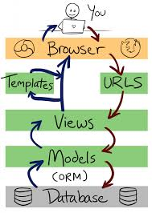
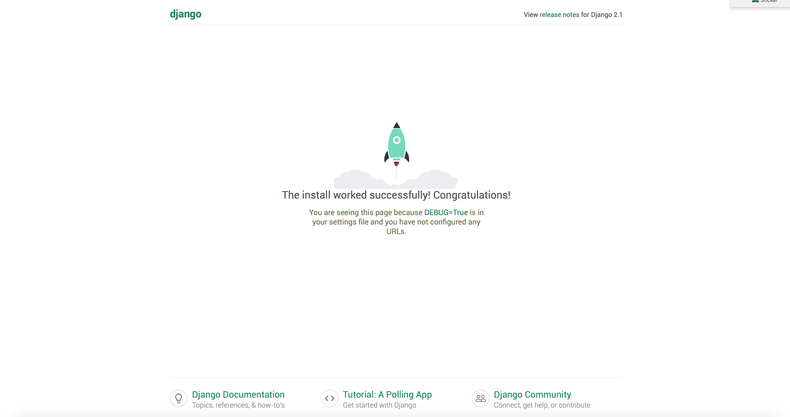
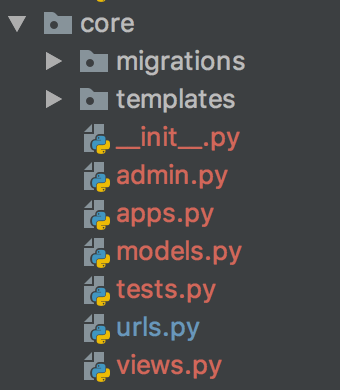

# Introducción a Django

## Preparando el entorno 

- Primero instalamos [virtualenv](https://virtualenv.pypa.io/en/latest/installation/) para poder gestionar nuestros
distintos entornos de desarrollo sin "contaminar" nuestro sistema operativo.

 
 `$ sudo apt update; sudo apt -y dist-upgrade; sudo apt -y autoremove` 
 
 `$ sudo apt install build-essential libssl-dev libffi-dev python3-dev python3-pip`
  
 `$ pip3 install virtualenv` - Importante hacer con el $USER (no root, no sudo)
 
 `$ virtualenv -p python3 venv` - Creamos un nuevo virtualenv para nuestro proyecto.
 
 `$ source venv/bin/activate` - Activamos el entorno virtual para nuestro nuevo proyecto.
 
 `$ pip install django==2.1.5` - Activamos el entorno virtual para nuestro nuevo proyecto.

## Introducción

- **Framework web** de alto nivel escrito en **Python** que fomenta el **desarrollo rápido y limpio** además del diseño 
pragmático.

- Nace en la redacción de World Online para crear aplicaciones web rápidamente con fechas ajustadas

- Su nombre viene dado en alusión al guitarrista de jazz Django Reinhardt.

- En 2005 fue liberado al público bajo la licencia BSD y desde 2008 es la DSF (Django Software Foundation) quien se hace
 cargo del proyecto con la intención de apoyar el desarrollo, promover su uso, proteger su propiedad intelectual y 
 asegurar su viabilidad a largo plazo.

- Sigue el principio **DRY**: Don't Repeat Yourself

- Para acabar destacar también la gran documentación oficial, un lugar perfecto para aprender, así como a su cada día 
más extensa comunidad de usuarios, lo que confirma su buen momento y el futuro que tiene por delante.

## Patrón MVT

Es el típico patrón MCV (Modelo-Vista-Controlador) que Django redefine a MVT (Modelo-Vista-Template).

- **URLs:** Aunque es posible procesar peticiones de cada URL individual vía una función individual, es mucho más sostenible escribir una función de visualización separada para cada recurso. Se usa un mapeador URL para redirigir las peticiones HTTP a la vista apropiada basándose en la URL de la petición. El mapeador URL se usa para redirigir las peticiones HTTP a la vista apropiada basándose en la URL de la petición. El mapeador URL puede también emparejar patrones de cadenas o dígitos específicos que aparecen en una URL y los pasan a la función de visualización como datos.

- **Vista (View):** Una vista es una función de gestión de peticiones que recibe peticiones HTTP y devuelve respuestas HTTP. Las vistas acceden a los datos que necesitan para satisfacer las peticiones por medio de modelos, y delegan el formateo de la respuesta a las plantillas ("templates").

- **Modelos (Models):** Los Modelos son objetos de Python que definen la estructura de los datos de una aplicación y proporcionan mecanismos para gestionar (añadir, modificar y borrar) y consultar regsitros en la base de datos.

- **Plantillas (Templates):** una plantilla (template) es un fichero de texto que define la estructura o diagrama de otro fichero (tal como una página HTML), con marcadores de posición que se utilizan para representar el contenido real. Una vista puede crear dinámicamente una página usando una plantilla, rellenandola con datos de un modelo. Una plantilla se puede usar para definir la estructura de cualquier tipo de fichero; ¡no tiene porqué ser HTML!

## ¿Qué tiene Django para que sea especial?

[Django](https://www.djangoproject.com/start/overview/) tiene lo imprescindible para que sea especial, ¡está escrito en Python!. Pero si te faltan razones aún...

• Provee una estructura de trabajo bajo el patrón Model Template View.

• Servidor local de desarrollo.

• Mapea objetos Python con la base de datos (ORM).

• Permite diseñar URLs amigables para buscadores (útil para
SEO).

• Tiene un sistema de plantillas sencillo para diseñadores.

• Genera una interfaz de administración automática.

• Dispone de un framework para manejar formularios.

• Puede gestionar sesiones de usuario, autenticación, caché,
almacenamiento, sitemaps, internacionalización... etc

## ¿Quién usa Django?

- Disqus
- Instagram
- Foundation Mozilla
- National Geographic
- Pinterest
- Open Stack
- Y muchos más!

## Crear proyecto

Para crear un proyecto Django tenemos que ejecutar el siguiente comando:

 `$ django-admin startproject narangram`
 
 Veamos lo que el comando **startproject** creó:
 
1. **El directorio raíz externo 'narangram/'** solo es un contenedor de su proyecto. Su nombre no es relevante para Django; se puede cambiar el nombre.
2. **manage.py:** Nos permite ejecutar comandos de Django sobre el proyecto (ej. para crear nuevas aplicaciones)
3. **El directorio interno 'narangram/'** es el paquete de Python real para su proyecto. Su nombre es el nombre del paquete de Python que tendrá que utilizar para importar nada en su interior (por ejemplo narangram.urls).
4. **narangram/__ init__.py:** Un archivo vacío que le dice a Python que este directorio debe considerarse como un paquete de Python.
5. **narangram/settings.py:** Contiene la configuración de la aplicación (conexión a bases de datos, aplicaciones instaladas, etc.).
6. **narangram/urls.py:** Las declaraciones URL para este proyecto Django; una “tabla de contenidos” de su sitio basado en Django.
7. **narangram/wsgi.py:** Un punto de entrada para que los servidores web compatibles con WSGI puedan servir su proyecto.

## Arranquemos nuestro servidor de desarrollo

`$ cd narangram`

`$ python manage.py runserver`

## Proyecto vs Aplicaciones

Como vimos, Django se basa en el principio DRY y por ello introduce un sistema de reutilización de código 
organizado en apps, podemos verlo como aplicaciones internas que implementan funcionalidades específicas.

Cada aplicación que escribimos en Django consiste en un paquete de Python que sigue una determinada convención.

Django tiene una utilidad que genera automáticamente la estructura básica de directorios de una aplicación, 
lo cual nos ayuda a que nos centremos en escribir código en lugar de crear directorios ¡WIN! \o/

Django tiene muchas apps genéricas para gestión de usuario, mensajes, sesiones, admin... pero también nos permite crear 
las nuestras propias, y eso es una de las mejores ideas de este framework, pues una app no tiene que limitarse 
a un solo proyecto, sino que se puede reutilizar en varios. 
En los repositorios de [PyPi](https://pypi.org) o en [https://djangopackages.org](https://djangopackages.org) existen 
muchísimas apps de Django creadas por la comunidad y que podemos usar en nuestros proyectos Django fácilmente.

- Un proyecto puede tener estar compuesta por muchas aplicaciones.

- Una aplicación puede estar en varios proyectos.

Ahora que ya sabemos la diferencia vamos a empezar creando nuestra primera app que compondrá nuestro proyecto 
**narangram**. Crearemos la app que gestionará el registro de usuarios, login, logout.

`$ python manage.py startapp naranuser`

Eso va a crear un directorio **naranuser** con la siguiente estructura de directorios:

