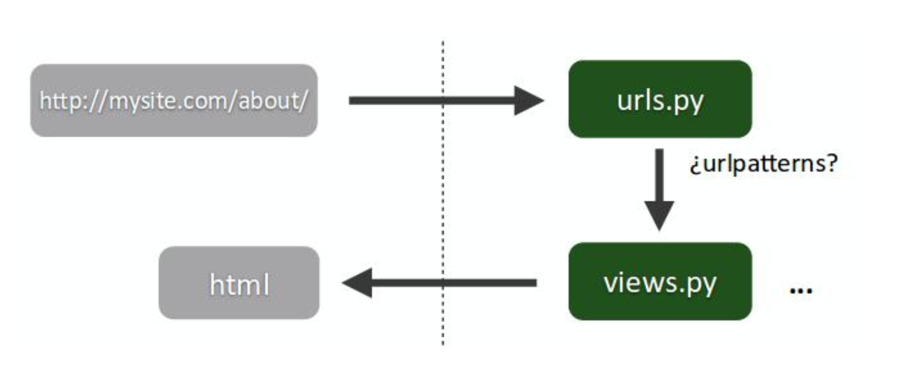
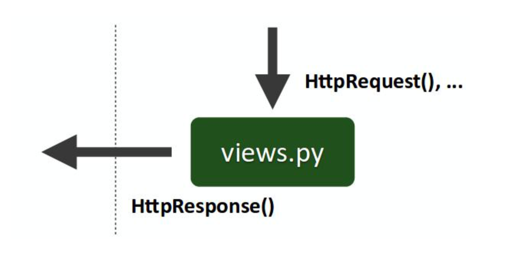

# URLs y Views

De los ficheros que se crearon en nuestra app **naranuser** el que nos interesa en esta sección es el llamado 
**views.py**. 

Este fichero es uno de los más importantes y en él se definen las vistas de la app. En la vista es dónde programaremos 
la lógica que se ejecuta cuando se hace una petición a nuestra web y lo que vamos a hacer es crear una vista 
para procesar la petición a la raíz de nuestro sitio.

```
from django.shortcuts import render, HttpResponse


def hello_world(request):
    return HttpResponse("Hello World!")

```

Cada vista se corresponde con una función del fichero **views.py**. 
Nuestra vista __hello_world__ recibe un argumento llamado request, se trata de la petición y  contiene mucha información
de la que podemos hacer uso.

Una vez que tenemos la vista (nuestra lógica de negocio) programada, tenemos que decirle a Django en qué URL 
tiene que mostrarla. Para ello crearemos un fichero **urls.py** en nuestra app naranuser con el siguiente contenido:

```
from django.urls import path

from . import views

urlpatterns = [
    path('', views.hello_world, name='hello_world'),
]

```

¿Recordáis el fichero narangram/urls.py dentro del directorio de configuración del proyecto? Pues es momento de 
volver ahí para indicarle que tenemos una app y que añada sus urls al proyecto:

```
from django.contrib import admin
from django.urls import include, path

urlpatterns = [
    path('naranuser/', include('naranuser.urls')),
    path('admin/', admin.site.urls),
]

```

La función **include()** permite hacer referencia a otros URLconfs. Cada vez que Django encuentra include() corta cualquier 
parte de la URL que coincide hasta ese punto y envía la cadena restante a la URLconf incluida para seguir el proceso.


- El fichero **urls.py** actúa como puerta de entrada para las peticiones HTTP
- Se definen URLs elegantes mediante expresiones regulares que redirigen a funciones de **views.py**



- La función de **views.py** recibe como parámetros un objeto **HttpRequest** y todos los parámetros de la URL 
capturados, teniendo que devolver siempre un objeto **HttpResponse**.


